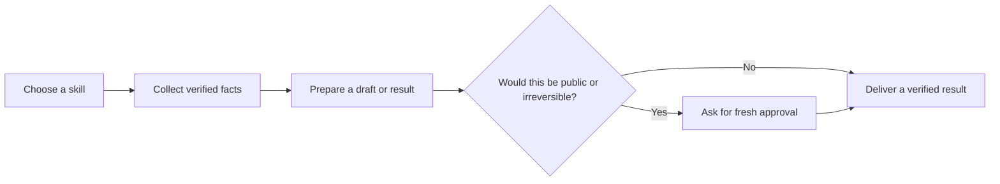

# ChaithawatPon Skills

Public, reusable agent skills for practical work. Each skill is a small package
with clear instructions, safety checks, and approval gates for public actions.

## What you get

- A catalog of skills for selling, university work, daily tasks, professional
  profiles, and media.
- Public-safe source only: no credentials, browser sessions, private messages,
  personal files, or real customer data.
- A Claude Code plugin that points to `skills/`.

## How a skill works



In short: the skill checks facts first. It asks before posting, publishing,
sending, buying, or deleting. Then it reports what actually happened.

## Install

Install the catalog with a skills-compatible agent:

```bash
npx skills add ChaithawatPon/skills
```

Or install one skill manually:

```bash
git clone https://github.com/ChaithawatPon/skills.git
cp -R skills/<category>/<name> ~/.claude/skills/<name>
```

To use the Claude Code marketplace, add it in Claude Code:

```bash
claude plugin marketplace add ChaithawatPon/skills
claude plugin install chaithawatpon-skills@chaithawatpon-skills
```

## Use a skill

1. Choose a category below.
2. Open the skill's `SKILL.md` file.
3. Give the agent the task in normal language.
4. Review any draft or approval request before a public action.

## Categories

| Folder | Use it for |
|---|---|
| `selling` | Marketplace listings, seller tools, and service offers. |
| `university` | Verified assignment briefs, files, and review-ready work. |
| `daily` | Planning, privacy, finance, research, and Mac maintenance. |
| `professional` | Public profiles, portfolios, and opportunities. |
| `media` | Video and media work from rough input to reviewed output. |

## Selling

| Skill | Outcome |
|---|---|
| [sell-to-facebook-marketplace](skills/selling/sell-to-facebook-marketplace/SKILL.md) | Marketplace listings and seller workflows with approval before public actions. |
| [sell-to-shopee](skills/selling/sell-to-shopee/SKILL.md) | Second-hand Shopee drafts and seller-centre work. |
| [sell-to-thaimart](skills/selling/sell-to-thaimart/SKILL.md) | Second-hand ThaiMart drafts and seller-centre work. |
| [sell-to-tiktok-shop](skills/selling/sell-to-tiktok-shop/SKILL.md) | TikTok Shop drafts, orders, and shoppable basket content. |
| [post-service-on-fastwork](skills/selling/post-service-on-fastwork/SKILL.md) | Thai Fastwork service listings with review before save or publish. |

See [selling details](docs/selling.md).

## University

| Skill | Outcome |
|---|---|
| [check-assignment](skills/university/check-assignment/SKILL.md) | Collects verified lecture files and assignment briefs from visible course sources. |
| [get-file-from-assignment](skills/university/get-file-from-assignment/SKILL.md) | Retrieves and verifies files for one course, then saves them to configured destinations. |
| [do-assignment](skills/university/do-assignment/SKILL.md) | Builds a review-ready deliverable after an ideas interview and outline approval. |
| [eli5-assignment](skills/university/eli5-assignment/SKILL.md) | Explains one verified brief as a simple visual HTML page. |

See [university details](docs/university.md).

## Daily

| Skill | Outcome |
|---|---|
| [today-obsidian](skills/daily/today-obsidian/SKILL.md) | Builds a daily cockpit from unfinished tasks and verified work evidence. |
| [clean-mac-storage](skills/daily/clean-mac-storage/SKILL.md) | Audits Mac storage and cleans only exact, approved targets. |
| [mac-health](skills/daily/mac-health/SKILL.md) | Routes storage, privacy, or combined personal-maintenance audits. |
| [clean-digital-footprint](skills/daily/clean-digital-footprint/SKILL.md) | Inventories social activity and deletes only approved items. |
| [find-room](skills/daily/find-room/SKILL.md) | Finds current rentals with verified price, commute, and approval-gated outreach. |
| [find-item](skills/daily/find-item/SKILL.md) | Compares current products or second-hand listings using direct evidence. |
| [find-sell-spont](skills/daily/find-sell-spont/SKILL.md) | Finds short-term preloved-item stalls and verifies fees and seller eligibility. |
| [find-place-to-eat](skills/daily/find-place-to-eat/SKILL.md) | Finds places to eat using branch, menu, hours, price, and review evidence. |
| [transaction](skills/daily/transaction/SKILL.md) | Adds confirmed entries to an optional spreadsheet template or new tracker. |

See [daily details](docs/daily.md).

## Professional

| Skill | Outcome |
|---|---|
| [social-update](skills/professional/social-update/SKILL.md) | Professional profiles, portfolio content, job research, and approval-gated outreach. |

See [professional details](docs/professional.md).

## Media

| Skill | Outcome |
|---|---|
| [edit-video](skills/media/edit-video/SKILL.md) | Turns user-provided clips into a reviewed cut plan, preview, captions, and final render. |

See [media details](docs/media.md).

## Develop and verify

```bash
npm run list
npm test
```

Each package needs a valid `SKILL.md`, clear usage and approval gates, synthetic
examples only, and validation plus runtime tests where needed.

## Repository map

| Path | Purpose |
|---|---|
| `.claude-plugin/` | Claude Code marketplace and plugin metadata. |
| `.github/workflows/` | Catalog validation in GitHub Actions. |
| `docs/` | Short category guides. |
| `scripts/` | Local catalog tools and validation. |
| `skills/` | Installable skill packages. |
