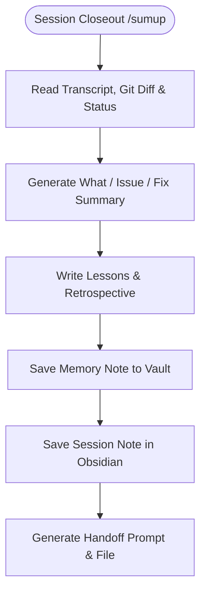

# sumup

Wraps up a session so nothing gets lost when switching to a new task or session.

## What it does

Reads the real conversation transcript, git diff, and filesystem state to reconstruct what was actually done this session. Writes a what/issue/fix/retrospective summary, saves a session note to Obsidian, updates project documentation (README, CLAUDE.md, AGENTS.md), saves a lesson to memory if one surfaced, and writes a paste-ready handoff prompt for a fresh session to continue exactly where this one ended.

## Visual Closeout Flow



## Example

**You type:**
```
/sumup
```

**What happens:**

1. Reconstructs work done: "Fixed auth token expiry check in middleware, added regression test, cleaned up debug logs."
2. Lists issues hit: "Token expiry was checking `now > expiry` instead of `>=`. Took 2 attempts to find root cause."
3. States how each was fixed: "Applied fix and re-ran original reproduction test."
4. Writes retrospective: "Should have instrumented the token-check boundary immediately instead of starting with grep."
5. Saves a memory note: `feedback-token-boundary-instrumentation.md` — "When debugging time-based bugs, instrument the exact boundary before guessing hypotheses."
6. Saves session note to Obsidian under the project that was worked on.
7. Updates project README/CLAUDE.md if any conventions changed.
8. Writes handoff file: `~/Obsidian Vault/hand-off/<project>/<task>/DD-MM-YYYY/handoff.md`
9. Prints a paste-ready handoff prompt:
   ```
   Continuing: Fix auth token expiry

   Current state:
   Token check fixed in middleware.py line 42. Regression test added. All tests passing.

   Next steps:
   1. Deploy to staging
   2. Verify token expiry on staging for 48 hours

   Full handoff: ~/Obsidian Vault/hand-off/<project>/<task>/DD-MM-YYYY/handoff.md
   ```

## Setup

Requires `$VAULT` environment variable pointing to your Obsidian vault (e.g. `~/Obsidian Vault`). If unset or the vault doesn't exist, the skill prints summary to terminal instead of saving files.

Requirements: a host agent that can read the current session and filesystem;
Git is optional but needed for Git-backed evidence. No network credential is
required.

## Install

```bash
git clone https://github.com/ChaithawatPon/sumup.git ~/.claude/skills/sumup
```

## Privacy

Session transcripts and handoffs may contain private information. Store them in
the user-selected vault, not in this repository. Never commit transcripts,
tokens, cookies, customer data, private repository content, or absolute local
paths. Shared examples must use synthetic names and paths.

## Validate

Run from the repository root:

```bash
python3 scripts/validate-skill.py
```

Then invoke `/sumup` in a disposable test project and verify that no output is
written outside the configured test vault.

## Troubleshooting

- Nothing is saved: confirm `$VAULT` exists and is writable.
- Git evidence is missing: run inside the intended repository or accept the
  filesystem/session-only summary.
- A summary contains private data: stop before sharing and redact the generated
  note; never publish the vault as test evidence.

## License

[MIT](LICENSE). Generated summaries remain the user's content.
