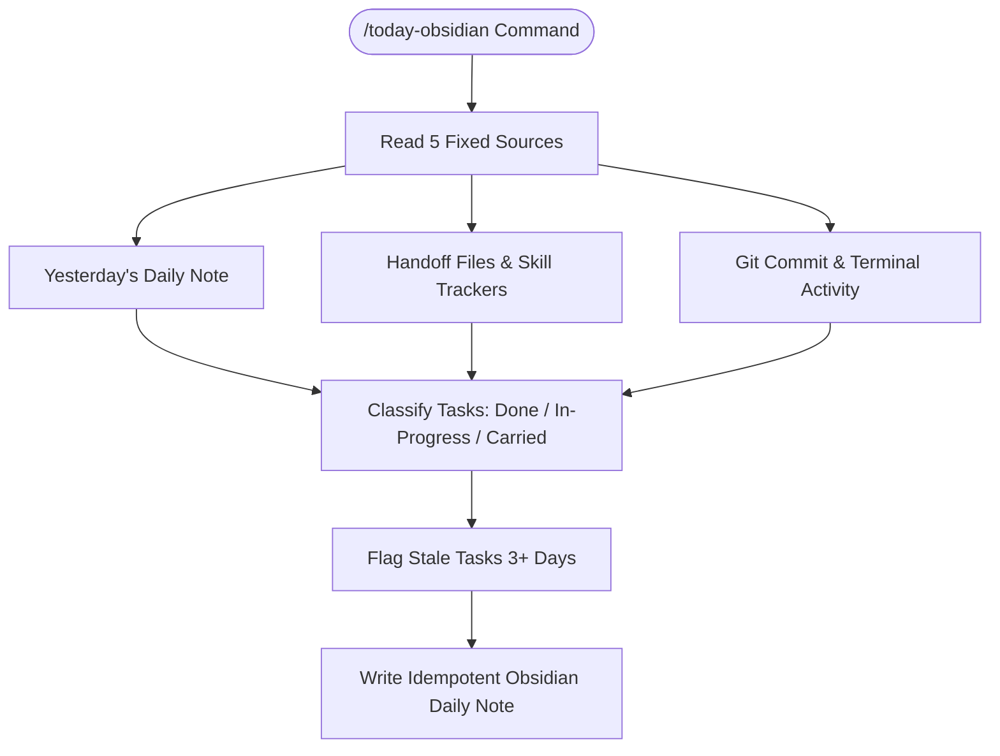

# today-obsidian

Builds your daily cockpit note in Obsidian by carrying forward unchecked tasks and computing priorities.

## What it does

Reads from 5 fixed sources (yesterday's daily note, handoff files, skill loop tracker, focus hub, today's journal) and builds today's note with: a one-line status summary (done/in-progress/carried counts), a project priorities section, carried-over tasks marked stale if rolling 3+ days, and a project staleness check. Additive and idempotent — safe to re-run same day without duplicating or erasing your own scribbles. Classifies each carried task by reading terminal activity (git commits, session transcripts) to mark what's actually done vs still in progress.

## Visual Cockpit Pipeline



## Example

**You type:**
```
/today-obsidian
```

**What happens:**

1. Finds yesterday's daily note. Reads all unchecked `- [ ]` tasks.
2. Checks handoff files, skill tracker, focus hub for new items.
3. Reads git commits since yesterday to see which tasks were actually completed.
4. Writes `Personal/daily/15-01-2026.md`:
   ```
   Status: 4 tasks — 1 done · 1 in progress · 2 carried (1 ⚠️stale)

   ## Project Priorities
   ### example-project
   Summary: 2 tasks, top P1 via /improve-skill
   #### /improve-skill
   - [x] P1 · required · Agent — Add input validation — shipped (a2f3e4)

   ## Carried Tasks
   - [ ] P2 · optional · You — Review documentation (since 13-01-2026)
   - [/] P1 · required · Agent — Verify validation output (since 14-01-2026) — in progress
   - ⚠️ [ ] P2 · required · You — Carry yesterday's task (since 12-01-2026)
   ```
5. Marks tasks done if git commits or transcripts prove they're finished.
6. Flags projects that should be archived (reads Obsidian project notes for status).

## Setup

Requires `$VAULT` environment variable pointing to a notes vault (for example,
`~/notes-vault`). Optional `$ACTIVE_REPOS` points to a user-configured project
directory. If the vault does not exist, the skill prints a summary to terminal.

## Install

```bash
git clone https://github.com/ChaithawatPon/today-obsidian.git "$HOME/.claude/skills/today-obsidian"
```

## Requirements and privacy

- Python 3.9+
- A writable vault selected through `$VAULT`
- Git only when commit activity should be used as evidence

The skill reads local notes and session evidence. Never commit a real vault,
session transcript, personal task content, account identifiers, or absolute
local paths to this repository. Fixtures and documentation must remain
synthetic.

## Validate

Run from the repository root:

```bash
python3 scripts/validate-skill.py
python3 scripts/test_today_obsidian.py
```

For an end-to-end check, point `$VAULT` to a disposable synthetic vault, run
`/today-obsidian` twice, and confirm the second run does not duplicate tasks or
erase text outside generated sections.

## Troubleshooting

- No daily note is written: confirm `$VAULT` exists and is writable.
- Wrong day or filename: check the host agent's local timezone and the required
  `DD-MM-YYYY.md` convention.
- Duplicate or missing tasks: test with a synthetic vault and inspect source
  markers before using a real vault; do not publish the real note as evidence.

## License

[MIT](LICENSE). Notes created in a user's vault remain the user's content.
