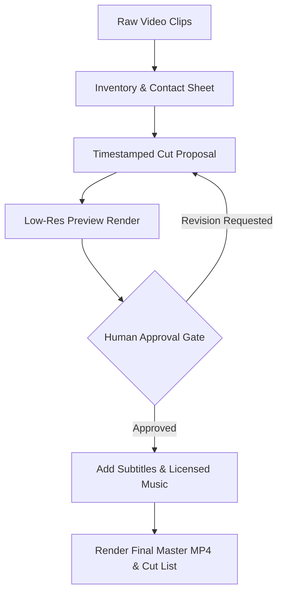

# edit-video

A portable, review-gated workflow for turning user-provided clips into a
captioned vertical video with a reproducible cut list. Source media stays
unchanged; previews, music, transcripts, and final renders require explicit
review at their own gates.

## Included

- [SKILL.md](SKILL.md): the tool-neutral editing and approval contract.
- [Emotion / intent / pacing](references/emotion-intent-pacing.md): observable,
  explainable signal-to-edit suggestions with privacy first.
- `scripts/test_fixture_smoke.py`: a synthetic ffmpeg + Pillow smoke test that
  uses no personal footage.

No footage, music, voice sample, transcript, browser state, private work log,
or machine-specific runtime workspace is included.

## Visual Pipeline



## Workflow

1. Preserve and inventory the original clips.
2. Grade a contact sheet and timestamped cut proposal.
3. Grade a low-resolution preview with authored overlays.
4. Add only approved/licensed music and reviewed speech captions.
5. Render a new final MP4 plus `cut-list.md` after every prior gate passes.

The model reference suggests keeps, cuts, pauses, captions, zooms, and beat
alignment from observable evidence. It does not infer a person's private
emotional state and it never promotes a proposal without human approval.

## Requirements

- Python 3.9+
- Pillow
- `ffmpeg` and `ffprobe` on `PATH`
- An optional, user-approved transcription backend when speech captions are
  requested

Install the declared Python dependency in an isolated environment:

```bash
python3 -m pip install -r requirements.txt
```

Run the clean-room test:

```bash
python3 edit-video/scripts/test_fixture_smoke.py
```

## Install

```bash
git clone https://github.com/ChaithawatPon/edit-video.git <skills-directory>/edit-video
```

Choose an absent destination; Git refuses to overwrite an existing directory.

## Configuration and privacy

No secret is required for the clean-room workflow. Optional transcription or
voice services must read credentials from environment variables; never put a
token, voice sample, transcript, or real source clip in this repository.

Use only user-owned or licensed media. Keep source footage unchanged and write
previews and final renders to a separate local project directory.

## Validate

From the repository root:

```bash
python3 scripts/validate-skill.py
python3 scripts/test_fixture_smoke.py
```

The smoke test creates synthetic media only.

## Troubleshooting

- `ffmpeg` not found: install it with the operating system's package manager
  and confirm both `ffmpeg` and `ffprobe` are on `PATH`.
- `No module named PIL`: run `python3 -m pip install -r requirements.txt` in
  the active isolated environment.
- Optional transcription fails: disable that backend and continue with a
  manual, reviewed transcript; do not upload private media silently.

## License

[MIT](LICENSE). Media processed by the skill keeps its original ownership and
license; the repository license does not grant rights to user media.
